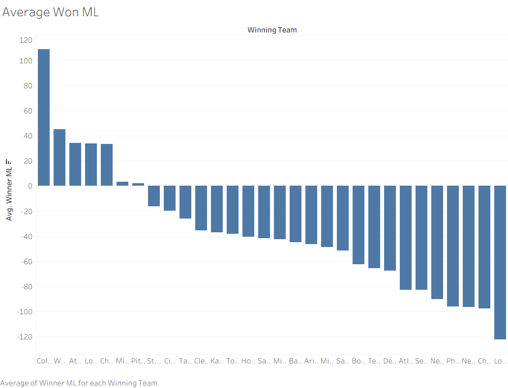
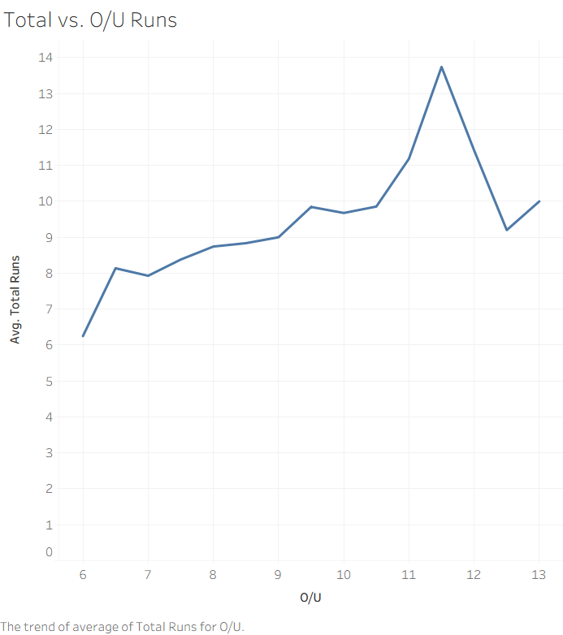
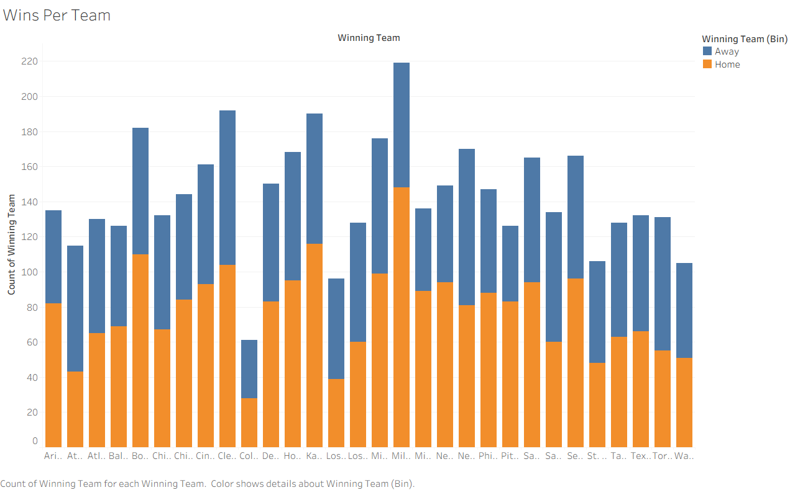

# Reflection & Interpretation
### Tymon Vu (tvu38@calpoly.edu) and Ian Wong (iwong12@calpoly.edu)

## Dataset Selection
Data files live [here](../data/), and were sourced from [Shane McDonald's Computer Solution Repository](https://shanemcd.org/).

Our dataset uses the full set of 2025 regular-season games and includes complete, finalized box score statistics for every matchup. This gives us access not only to final scores, but also to team-level performance metrics, pitching and batting summaries, and contextual information such as home/away designation and betting odds. By working with finalized outcomes rather than live or partial data, we ensure consistency across all observations and a reliable foundation for both descriptive analysis and predictive modeling.

## Exploratory Data Analysis (EDA)
For the key varaibles we decided to look at, we decided to visualize the given MLB team's betting odds as well as the overall game stats in each game in 2025. Below is a list of all the relevant variables that we will be analyze in order to visualize/see if there are any trends or any relevant signal to predict the game winners. 

Taken from source: 
- `Date_Start`: the date / time of the game
- `Away`: the name of the away team
- `Away Score`: the away team’s score if the game has been played, otherwise this field is empty
- `Home`: the name of the home team
- `Home Score`: the home team’s score if the game has been played, otherwise this field is empty
- `Away Starter`: the starting pitcher of the away team
- `Home Starter`: the starting pitcher of the home team
- `O/U`: the number of runs for an over/under bet
- `Over`: the odds that the Over bet pays, in American odds (AKA moneyline odds) format
- `Under`: the odds that the Under bet pays
- `Away ML`: the odds that the Moneyline bet on the Away team pays
- `Home ML`: the odds that the Moneyline bet on the Home team pays
- `Home RL Spread`: the spread for the Home team on the Run Line bet
- `RL Away`: the odds that the Run Line bet on the Away team pays
- `RL Home`: the odds that the Run Line bet on the Home team pays

Our dataset has exactly 4,301 registered games (rows) of the regular season in the 2025 MLB season. From our EDA, we noticed a couple of things. From the betting odds as visualized in the charts below, the best team as seen, the Los Angeles Dodgers, have an average Moneyline win rate of -125. This means that sportsbooks consistently viewed the Dodgers as strong favorites, requiring bettors to wager \$125 to profit $100 on average across the season. However, this moneyline number does not seem as drastic as what a "blowout" team would usually have. This signals that the 2025 MLB season has been relatively competitive and there weren't really any real underdogs in the regular season (besides the Colorado Rockies).

Additionally, it seems that when comparing sports books original O/U on runs scored on the actual final result of the game, the spots books were mainly accurate. At least if the line was from 6-9 runs, there seems to be a general straight line that matched up that showed how close the final game score is. However, for high scoring games predicted that were above like 10+ runs, the betting lines were raelly off, by either being a really high schoring game or a low scoring game, which makes sense because with such a high number it's unpredictable what could happen.

We also recognize that most teams seem to win a lot more games at home rather than away (at least 50%+). This makes a lot of sense intuitively since teams usually travel the night or day before having to play a baseball game in a region they are unfamiliar with, so there are several of those factors including travel fatigue that could affect a team's performance. 

The image below shows how strongly each team was expected to lose on average. 
We can see that the Colorado Rockies were underdogs in most of their wins,
whereas the LA Dodgers were heavily favored in most of their wins. This graphic serves as a sort of proxy for power ratings.

This next image shows the total number of runs scored in a game against the over/under score (averaged).
We see that O/U is generally an accurate predictor of whether a game will be low- or high-scoring.

This last image shows the distribution of total wins for each team throughout the 2024-2025 season.
Color also indicates home versus away wins. As expected, we find that the Rockies won the least games and the Dodgers won the most.
This aligns with our previous findings.

## Looking Ahead
We see the betting lines as holding great potential for predicting off of. Since these have been calculated carefully before each game,
features such as the ML, RL, and O/U likely hold good signal for predicting the winner of the game.
Starting pitchers could also be a good feature to use, since baseball is known to be dominated by pitching.
Additionally, the team strength indicators we were able to glean from averaging across the season will also be useful
when trying to predict the winner. A stronger team will likely beat a weaker team.

A potential challenge we would need to be cautious about is data leakage, obvious examples being the score columns.
These contain information about the outcome, and should _not_ be included in the feature space when training the model.
We must carefully separate pre-game and post-game features.

We may also run into data sparsity issues, specifically with pitchers who don't pitch often or rare team matchups.
Potential solutions would be aggregation by team or time period, or filtering for outliers with few interactions.

As of now, most data fields are strings. If we are able to connect teams or pitchers with IDs, we could merge the data with additional
information such as ERA from other sources. This may or not be helpful and remains to be explored.

We are also still in discussion on the main output of our eventual model. Options we are considering include predicting the winner
of a match given the two teams and related info, or producing the betting lines ourselves and comparing them to real betting odds.
In any case, our aim is to leverage the tools we have gained throughout this course to create an accurate predictor using this MLB data.